<div align="center">


# NetSet – The Badminton Connect

**A coaching app for badminton academies — Android & iOS from one codebase.**

Daily attendance · coach-defined drills scored 1–10 · match & tournament logs · 7 / 15 / 30-day performance reports · PDF export shared on WhatsApp · light & dark mode

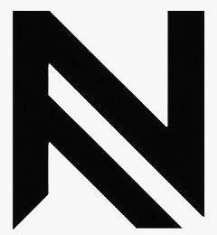 &nbsp;**Licensed & Powered by NEXONVATE**

</div>

---

## Features

| | |
|---|---|
| **Attendance** | Mark each student Present / Absent for any date. One record per student per day. |
| **Drills & scoring** | Coach creates, renames, rescales (1–5 or 1–10) or deletes drills (e.g. Smash, Stamina, Footwork). Score students one by one or the whole present batch at once. |
| **Matches & tournaments** | Log singles/doubles results with date, partner, opponents, score and notes; record tournament results. |
| **Student report** | For 7, 15 or 30 days: overall score, growth, rank in batch, attendance %, won/lost, each skill vs batch average, and a "where you stand" chart against other students. |
| **PDF report** | Academy + coach name on the left, student name + photo on the right, graphs, skill table, match record, attendance calendar, coach remarks, and the NEXONVATE footer on every page. Preview in-app, then share to WhatsApp or save. |
| **Coach profile** | Academy name, coach name, contact and logo used on every PDF. |
| **Data** | Stored fully offline on the device. Export/restore a backup file. Demo data (6 students) on first launch; one-tap "Clear all data". |
| **Light / dark mode** | Toggle at the top of the Home screen (follows the phone setting until changed). |

---

## Screenshots

### iPhone (iOS Simulator)

| Home (light) | Home (dark) | Student report | Report (dark) |
|:---:|:---:|:---:|:---:|
| 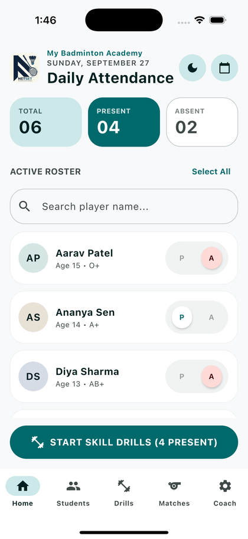 | 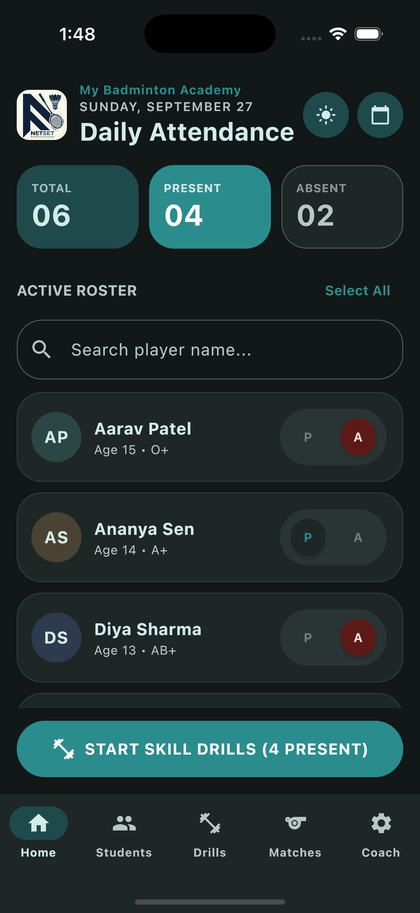 | 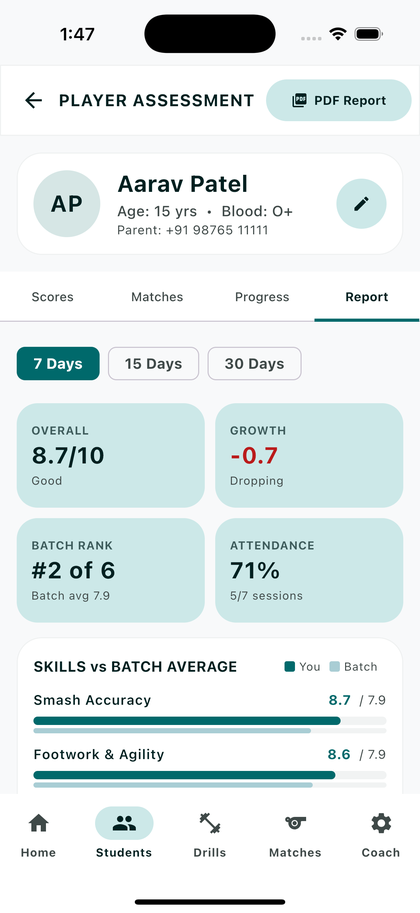 | 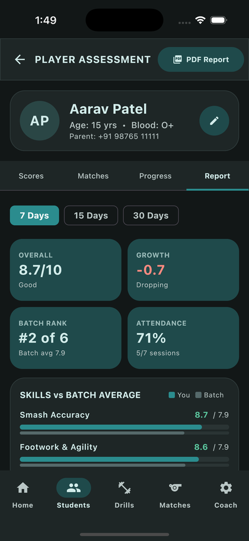 |

| PDF preview & share | Students | Drill scoring | Add / edit drills |
|:---:|:---:|:---:|:---:|
| 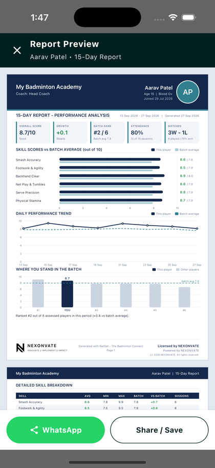 | 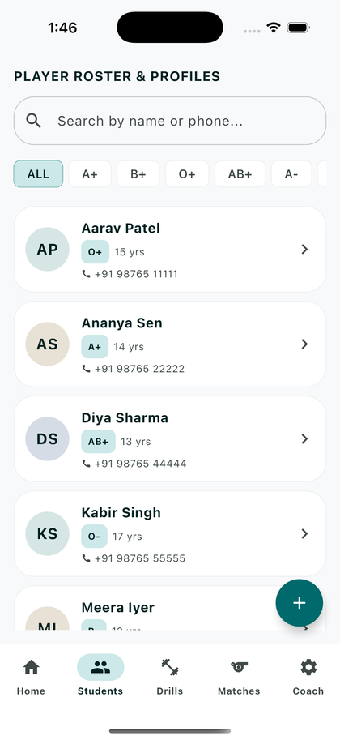 | 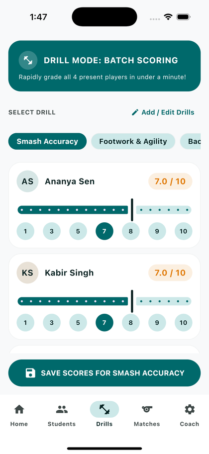 | 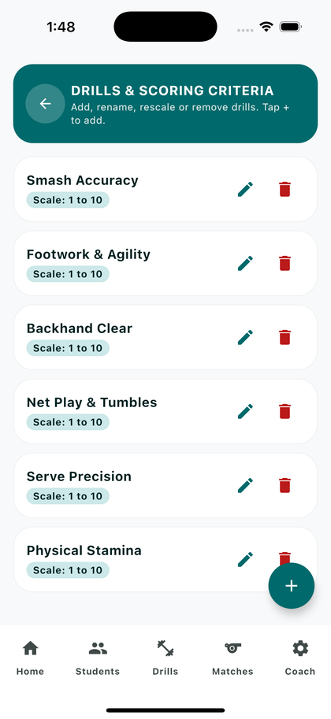 |

| Matches | Coach profile | Drills (dark) | Matches (dark) |
|:---:|:---:|:---:|:---:|
| 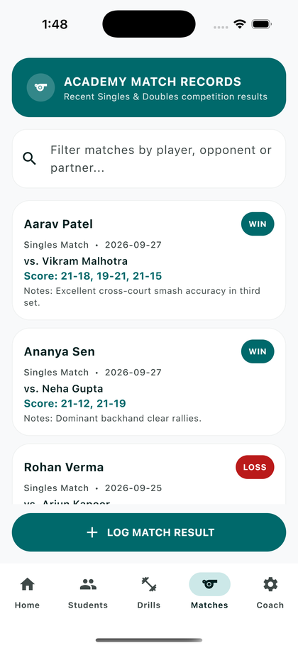 | 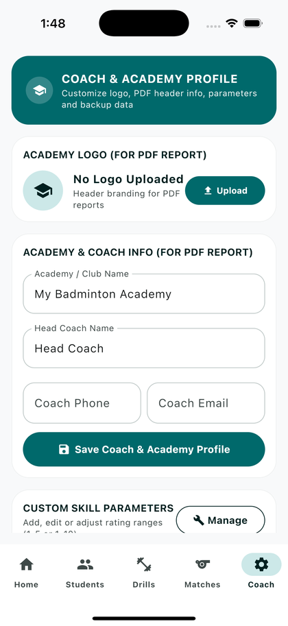 | 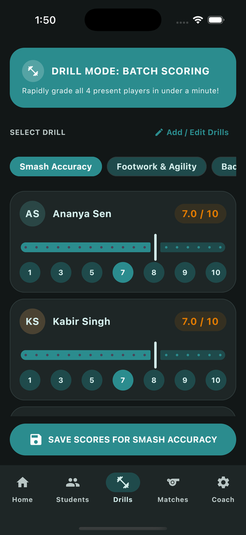 | 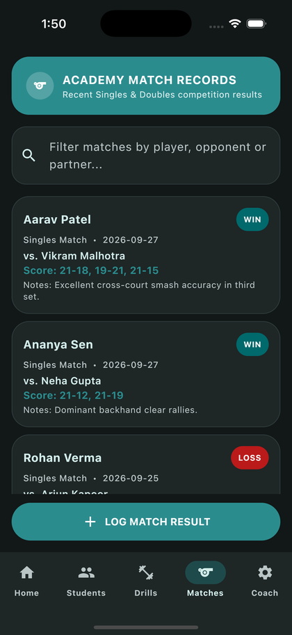 |

### Android (Xiaomi phone)

| Home (dark) | Home (light) | Student report | Report – 15 days |
|:---:|:---:|:---:|:---:|
| 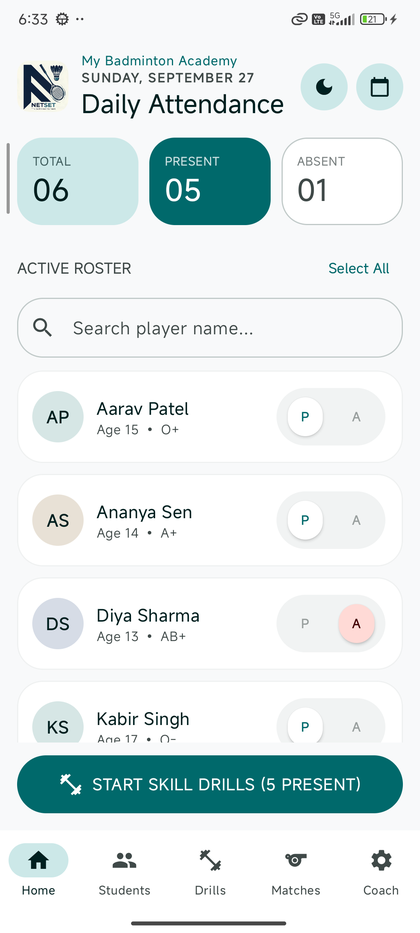 | 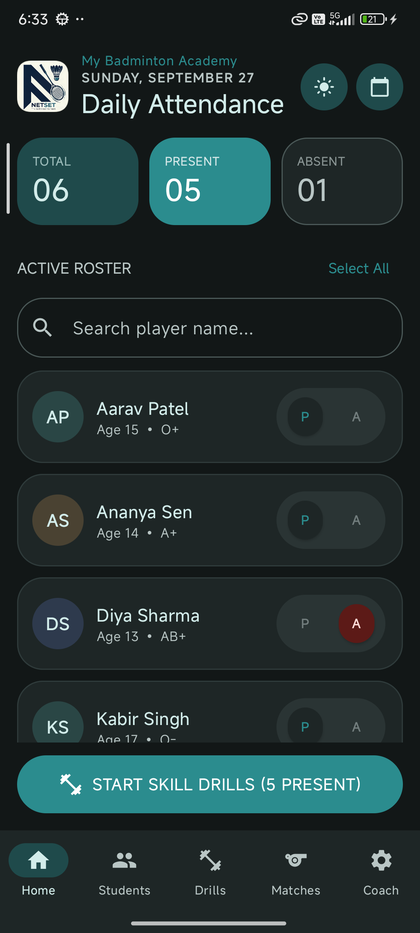 | 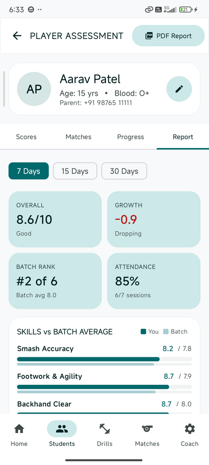 | 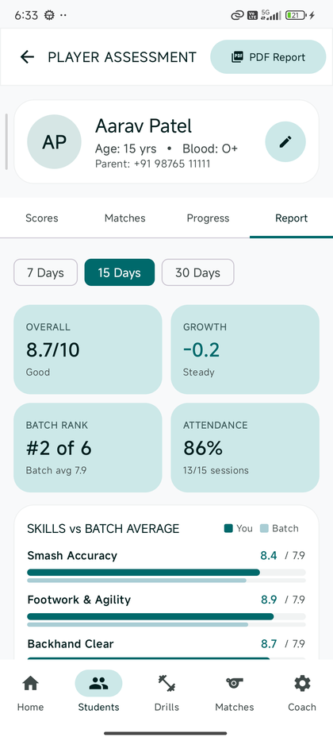 |

| PDF preview & WhatsApp | Drill scoring | Add / edit drills | Matches |
|:---:|:---:|:---:|:---:|
| 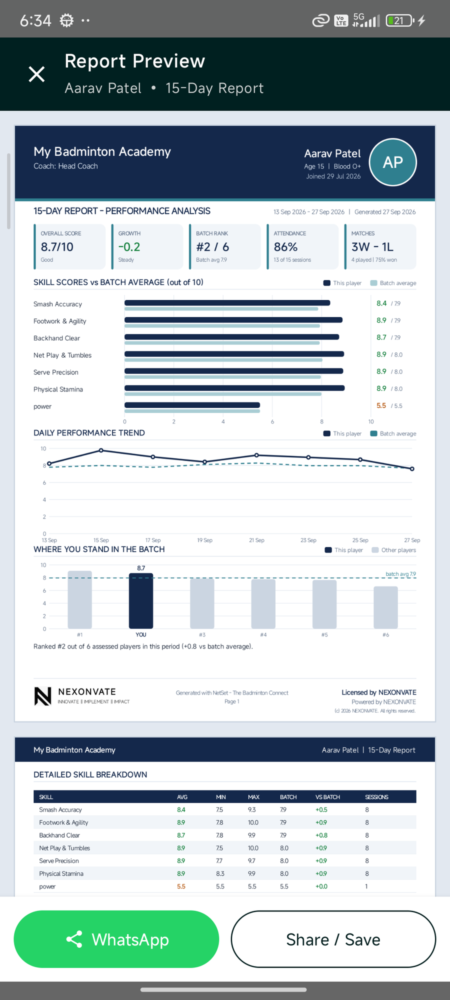 | 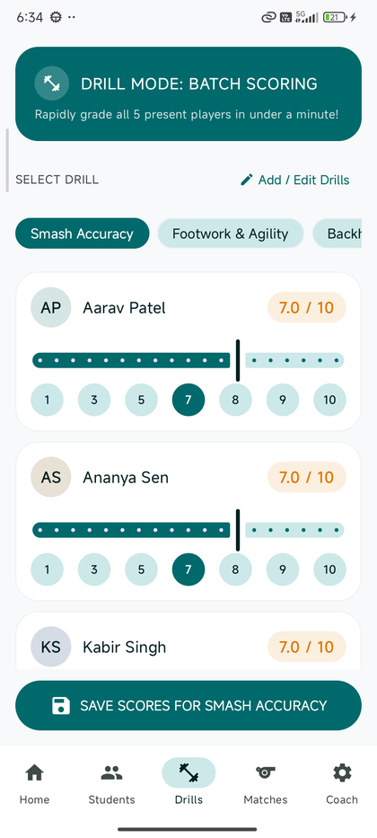 | 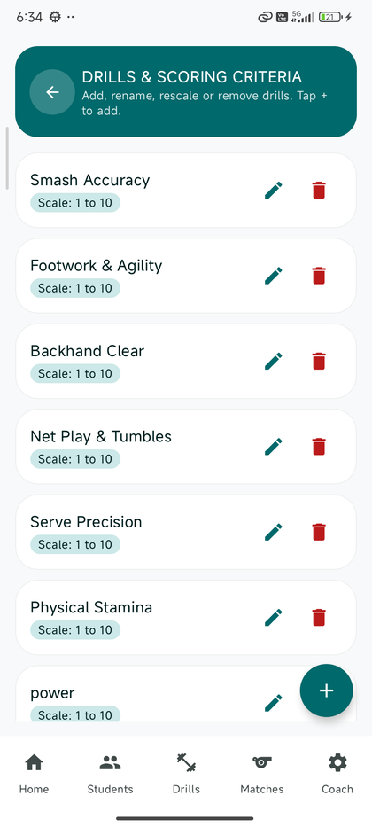 | 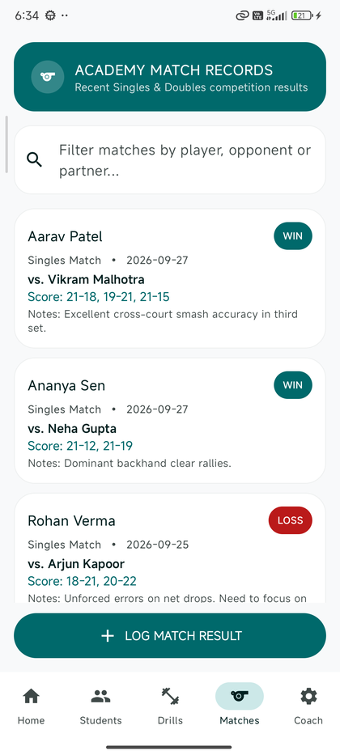 |

| Coach & NEXONVATE branding |
|:---:|
| 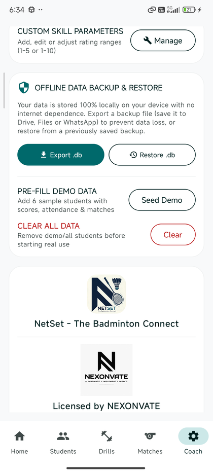 |

### PDF report (shared with parents)

| Page 1 | Page 2 |
|:---:|:---:|
| 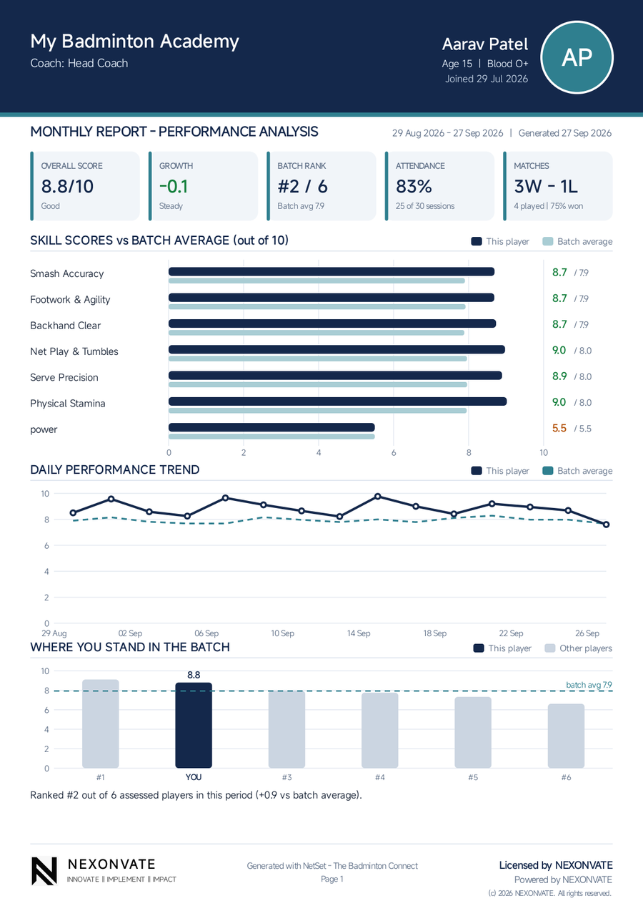 | 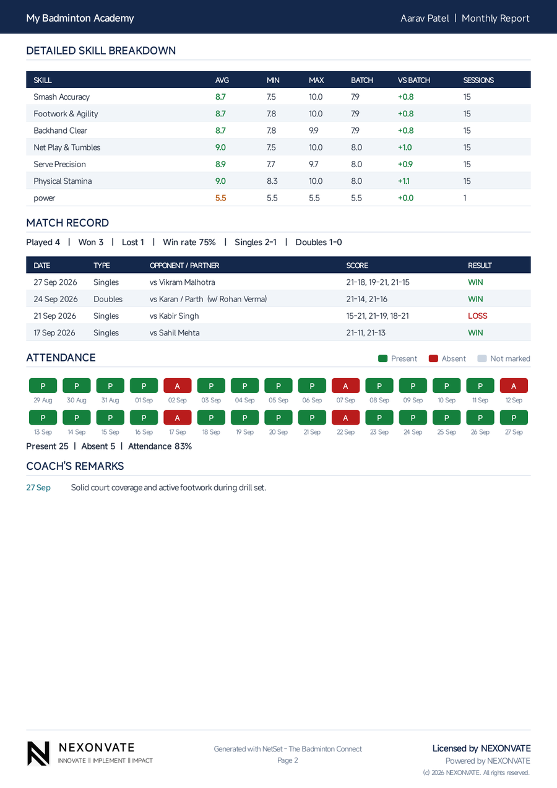 |

---

## Tech stack

- **Kotlin Multiplatform + Compose Multiplatform 1.12** — one UI for Android and iOS
- **Room (KMP) + bundled SQLite** — offline database on both platforms
- **kotlinx-datetime / kotlinx-serialization** — dates and score storage
- PDF drawn once in shared code through a small canvas interface
  (Android `PdfDocument`, iOS UIKit/CoreGraphics)

## Project layout

| Folder | What it is |
| --- | --- |
| `shared/src/commonMain` | All screens, view model, database, report analytics, PDF layout |
| `shared/src/androidMain` | Android pieces: files, settings, PDF drawing, WhatsApp/share, photo & file pickers, PDF preview |
| `shared/src/iosMain` | iOS pieces: the same, using Foundation, UIKit, PDFKit, PhotosUI |
| `app/` | Android app shell (`MainActivity`) + on-device preview test |
| `iosApp/` | iOS app shell (SwiftUI) described by `project.yml` for XcodeGen |
| `.github/workflows/build.yml` | Cloud build: Android APK + iOS simulator build with screenshots |
| `docs/screenshots/` | Screenshots used in this README |

## Build

### Android

Requires JDK 17+ and the Android SDK (compileSdk 37).

```bash
./gradlew :app:assembleDebug     # APK -> app/build/outputs/apk/debug/app-debug.apk
./gradlew :app:installDebug      # install on a connected phone
```

### iOS (Mac with Xcode 16+)

```bash
brew install xcodegen
cd iosApp && xcodegen generate
open NetSet.xcodeproj            # choose a simulator or iPhone and press Run
```

The Xcode build runs `./gradlew :shared:embedAndSignAppleFrameworkForXcode` automatically.

### Without a Mac

Every push runs the GitHub Actions workflow: it builds the Android APK and builds the iOS app on a
macOS runner, runs it in the iPhone Simulator (light and dark mode) and uploads screenshots, a sample
PDF, the APK and the simulator app under **Actions → run → Artifacts**.

## Publishing on iPhone

Installing on real iPhones (TestFlight or App Store) requires an
[Apple Developer Program](https://developer.apple.com/programs/) account ($99/year) for code signing.
Once the account exists, add the developer in App Store Connect and the signed build can be uploaded
to TestFlight, then submitted for App Store review.

Note: iOS does not let apps attach a file to a specific WhatsApp chat, so on iPhone the WhatsApp
button opens the share sheet (WhatsApp is listed there). Android sends straight to the parent's chat.

---

<div align="center">


**Licensed by NEXONVATE · Powered by NEXONVATE**

</div>
